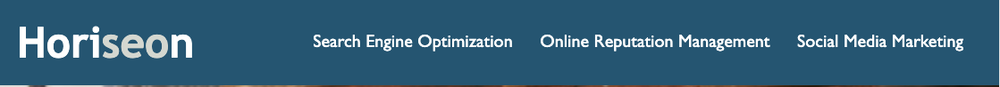
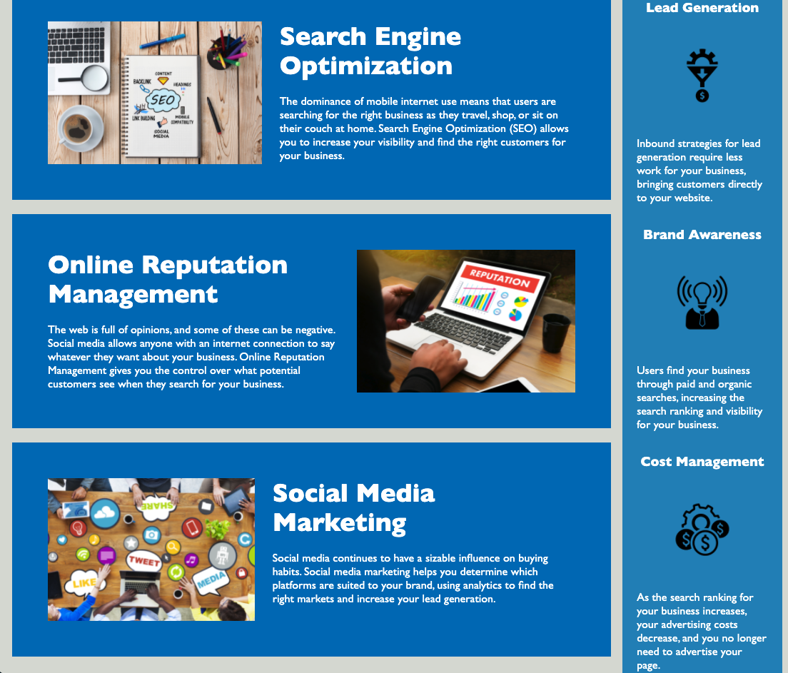

# jslidatectH

## Description

A marketing agency wanted their website to follow accessibility standards in order to be optimized for search engines. 

I cleaned :broom: up the HTML by adding semantic elements and getting rid of div soup :stew: .

Ensured all links were functional, eliminated repetitive css for an easy to follow codebase for long-term sustainability.

What you'll see before you is the [final product](https://disantoz.github.io/jslidatect/#social-media-marketing).

## Usage

The website header redirects to different sections of the page to get a better understand on marketing strategies.

After clicking on one of the header topics, you will be taken to the corresponding section .

